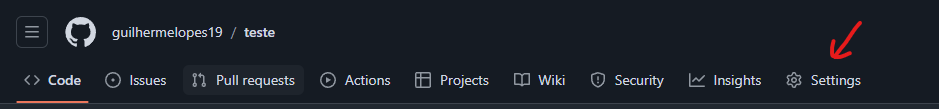
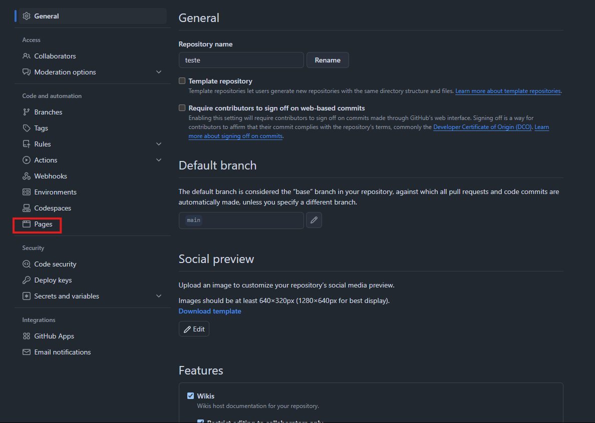
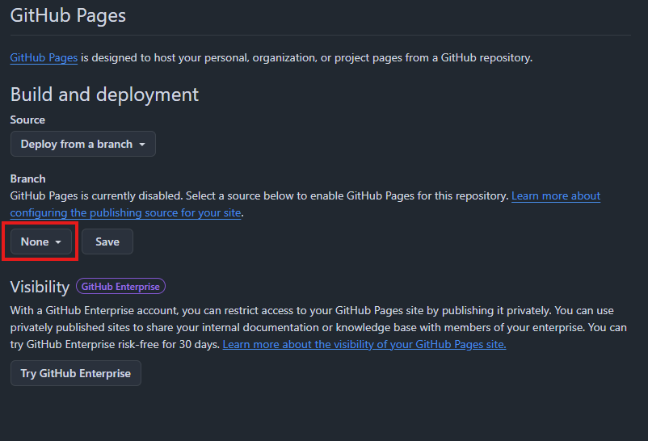
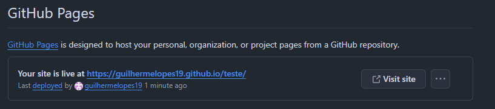

Neste tutorial buscamos explicar o uso de Markdown e GitHub pages na criação de sites estáticos. Veremos um breve resumo sobre o que é markdown, algumas de suas tags, e como publicar um site através do GitHub pages.

# O que é markdown?

Markdown é uma linguagem de marcação de texto criada para ser simples e de fácil entendimento. Seu objetivo é facilitar a criação de textos formatados, substituindo HTML em tarefas mais simples, como na criação de documentações ou posts de um blog.

Algumas de suas tags são:

- ## Título
Para indicar um título basta colocar um ````#```` no começo texto. Pode ser acrescentado mais # para indicar sub-títulos, sendo o máximo 6 ```#```.
 
 ```markdown
# Título 1
## Subtítulo 2
### Subtítulo 3
#### Subtítulo 4
##### Subtítulo 5
###### Subtítulo 6
 ```

- ## Links 

Para criação de links basta seguir a seguinte estrutura:
```markdown
[texto](link)
```
**Resultado**: 

[texto](#)

O link pode ser para uma página sua ou para uma url qualquer.

- ## Imagem
Para adicionar imagens, o processo é semelhante ao de um link:

```markdown

```

**Resultado**:


> Para encontrar mais informações sobre a sintaxe do Markdown, [Clique Aqui](https://www.markdownguide.org/basic-syntax/)

# O que é o GitHub Pages?
O Github Pages é um forma de você publicar um site estático através do Github. Para isso, você deve ter um arquivo index.html ou index.md na raiz do seu projeto e seguir os seguintes passos.

1. Estando no seu repositorio clique em 'Settings'



2. Clique em 'Pages'



3. Agora clique em None e selecione a branch onde está o seu projeto e clique em 'Save'



4. Por fim, após algum tempo o GitHub criará o link para a sua página seguindo a seguinte estrutura: `https://seu-nome-de-usuario.github.io/nome-do-seu-repositorio/`



> Para encontrar mais informações sobre o GitHub Pages, [Clique Aqui](https://docs.github.com/pt/pages/quickstart)

# Jekyll
O uso de Markdown em um navegador é possível graças ao Jekyll, que converte arquivos Markdown em HTML. O GitHub Pages possui suporte ao Jekyll, então você pode usar Markdown para criar seus sites. Para isso, basta colocar um arquivo index.md e as demais páginas do site em seu repositório, o GitHub Pages automaticamente identificará e converterá esses arquivos em HTML.

Por padrão, o Jekyll aplica um tema padrão, mas você pode modificá-lo através da criação de arquivo ``_config.yml``. Nele você pode configurar elementos do seu site como título, descrição e tema.

```yml
theme: jekyll-theme-minimal # Tema padrão
title: Titulo do seu site 
description: Descrição do seu site
```

> Para encontrar mais informações sobre o Jekyll, [Clique Aqui](https://docs.github.com/pt/pages/setting-up-a-github-pages-site-with-jekyll/about-github-pages-and-jekyll)

