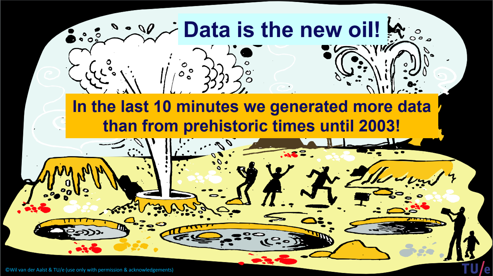
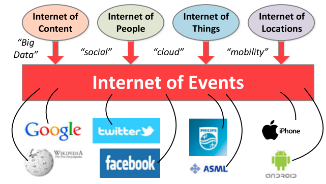
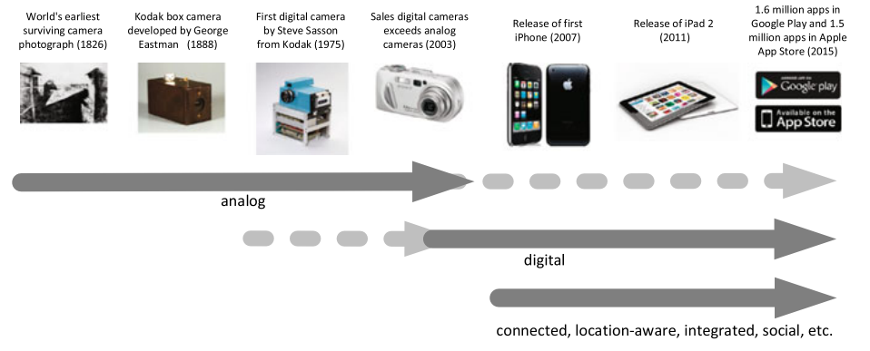
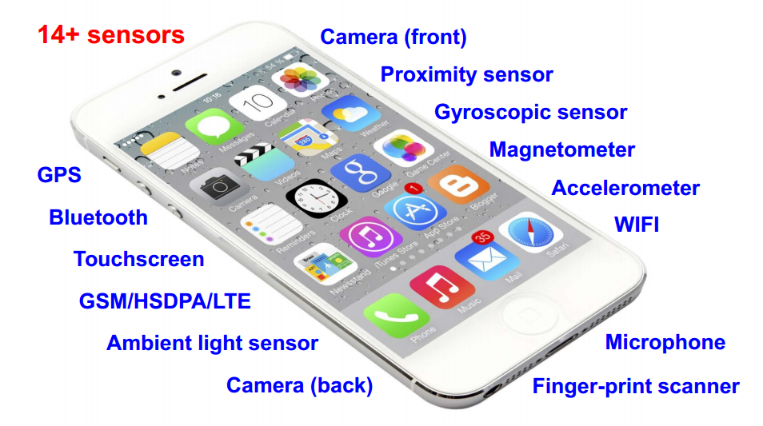
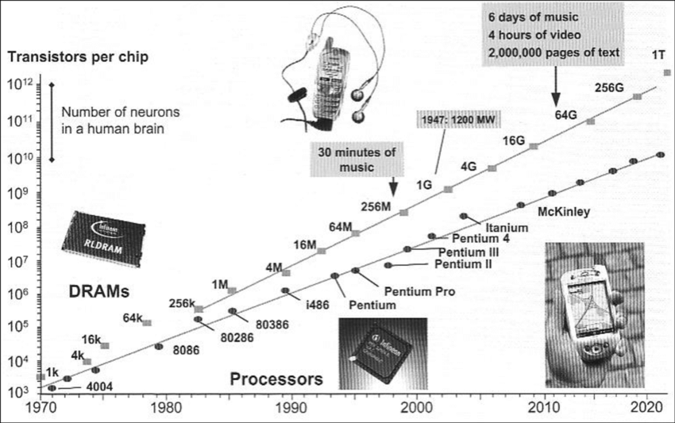
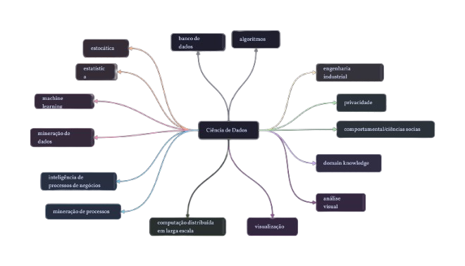
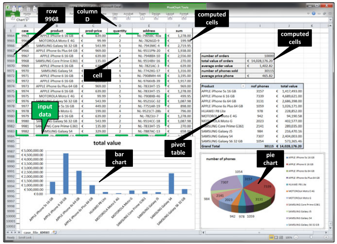

Nesta aula veremos um pouco sobre a mineração de processos, área essa que relaciona a modelagem de sistemas com a ciência de dados, permitindo transformar registros de eventos em melhorias para processos.  

## Dados é o novo petróleo!

Hoje em dia, nós estamos gerando uma quantidade de dados maior do que se juntarmos todas as informações da pré-história até o ano de 2003. 

Estamos criando constantemente **dados de evento (event data)**, quando

- marcamos uma consulta
- compramos uma xicara de café
- enviamos um e-mail
- assistimos um vídeo no YouTube
- através de todos os sensores em um smartphone

Quando falamos de todos esses dados sendo gravados, estamos falando da **Internet dos Eventos**.

  Evolução na forma de criação e manipulação de fotos

  Frequentemente, estamos gerando dados de eventos

  Sensores e interfaces de smartphones capturam dados

### Big Data

Hoje nós conseguimos criar e gravar uma enorme quantidade de dados. 

Para se ter uma ideia dessa evolução, pode-se citar **Lei de Moore** é a observação de que o número de transistores em circuitos integrados dobra aproximadamente a cada dois anos, o que resulta em um aumento exponencial na capacidade de processamento dos computadores. Proposta por Gordon Moore em 1965, essa tendência impulsionou a evolução da tecnologia por décadas. No entanto, à medida que os transistores se aproximam dos limites físicos, a Lei de Moore começa a desacelerar, desafiando a indústria a buscar novas soluções, como a computação quântica.

  2²⁰ = 1.048.576 * em 40 anos

Portanto, o desafio hoje é encontrar valor nesses dados.

####  Os 4 desafios do Big Data

- Volume: estamos criando grandes quantidades de dados
- Velocidade: a rapidez que os dados estão sendo criados e modificados
- Variedade: os dados não mudam apenas de tipo mas também de fontes como imagens, textos, vídeos, e devemos trabalhar com todos eles
- Veracidade: por conta do volume massivo de dados, pode existir uma dificuldade em verificar a confiabilidade dos dados

## A demanda por cientistas de dados

A crescente demanda por cientistas de dados é impulsionada pela necessidade das empresas de transformar grandes volumes de dados em informações úteis para tomar decisões mais informadas e estratégicas. 

Cientistas de dados aplicam técnicas de mineração de dados, como clustering, classificação, regressão e análise preditiva, para extrair padrões e insights de conjuntos de dados complexos. 

Esses profissionais desempenham um papel fundamental na análise de dados não estruturados e estruturados, utilizando ferramentas e algoritmos sofisticados para transformar dados brutos em conhecimento acionável.

### Ramos da Ciência de Dados

### Exemplo na Construção Civil:

/i.s3.glbimg.com/v1/AUTH_63b422c2caee4269b8b34177e8876b93/internal_photos/bs/2023/h/z/pnqTRSRoKK769dnnyaGg/8f75f61f-3207-4286-bc8b-678ffa51555d.jpg)

Na construção civil, a mineração de dados e a ciência de dados podem ser aplicadas para melhorar a eficiência dos projetos e reduzir custos. Um exemplo prático seria o uso de **análise preditiva** para otimizar o cronograma de obras. Cientistas de dados podem analisar dados históricos de projetos anteriores, como tempos de construção, custos de materiais, condições climáticas e desempenho de equipamentos. Usando técnicas de mineração de dados, como **modelagem preditiva**, é possível identificar padrões que indicam quais fatores mais impactam o progresso de uma obra. Com essas informações, as empresas podem prever possíveis atrasos e ajustar os cronogramas de forma mais eficaz, além de otimizar os recursos, como mão de obra e equipamentos, garantindo um melhor controle de custos.

Outro exemplo é o uso de **sensores IoT** em canteiros de obras, que geram dados em tempo real sobre a utilização de máquinas e materiais. Cientistas de dados podem analisar esses dados para detectar ineficiências, prever manutenções de máquinas e otimizar o consumo de recursos.

Esses avanços proporcionam maior previsibilidade, redução de riscos e uma gestão mais eficaz em grandes projetos de construção civil.

## Visão de dados

As planilhas podem ser usadas para fazer qualquer coisa com números, mas têm dificuldades em capturar adequadamente o comportamento dinâmico.

## Visão de processo

Van der Aalst critica a abordagem que foca apenas em padrões ou decisões isoladas, pois acredita que o verdadeiro valor está em entender e otimizar o processo de ponta a ponta. Ele considera "estúpido" tratar processos como uma coleção desconexa de boas práticas ou intervenções pontuais, pois isso ignora a eficiência global e os impactos no resultado final. Um processo pode ter partes otimizadas, mas se o fluxo completo não funcionar bem, o desempenho geral será comprometido. O foco em processos de ponta a ponta é essencial para alinhar eficiência local e global, gerando melhores resultados.

## Visão da mineração de processos

O comportamento dinâmico precisa estar relacionado a modelos de processo. Portanto, Aalst (2016) refere a isso como "ciência de dados em ação".

Exemplos de aplicações incluem:
analisar processos de tratamento em hospitais, melhorar processos de atendimento ao cliente
em uma corporação multinacional, entender o comportamento de navegação de clientes
usando um site de reservas, analisar falhas de um sistema de manuseio de bagagem e melhorar a interface do usuário de uma máquina de raio-X. 

## Exemplo na Construção Civil

Imagine a construção de um prédio. Se nos concentrarmos apenas em tarefas isoladas, como a alvenaria ou a instalação elétrica, podemos otimizar cada uma delas individualmente, mas o projeto como um todo pode sofrer. Por exemplo, se a equipe de elétrica chegar muito cedo para iniciar seu trabalho, enquanto a equipe de alvenaria ainda não concluiu sua parte, haverá um tempo de inatividade e recursos ociosos.

**Visão fragmentada:**

* **Foco:** Cada equipe trabalha de forma isolada, otimizando apenas suas tarefas.
* **Problema:** A equipe de encanamento inicia seu trabalho antes que a estrutura esteja completamente pronta, causando atrasos e retrabalhos.

**Visão da mineração de processos:**

* **Foco:** O processo de construção como um todo, desde a concepção do projeto até a entrega da obra.
* **Solução:** Criação de um cronograma detalhado, com todas as etapas interligadas e prazos bem definidos. As equipes são informadas sobre as dependências entre as tarefas, evitando atrasos e otimizando o uso de recursos.

**Benefícios da visão de mineração de processos na construção civil:**

* **Redução de custos:** Minimização de retrabalhos, otimização do uso de materiais e redução de tempo de obra.
* **Melhora da qualidade:** Aumento da precisão e da qualidade do trabalho, com menos erros e defeitos.
* **Aumento da produtividade:** Melhor coordenação entre as equipes, redução de interrupções e otimização do fluxo de trabalho.
* **Maior satisfação do cliente:** Entrega do projeto dentro do prazo e com a qualidade esperada.

## Referências

- VAN DER AALST, Wil. **Process Mining**: Data science in action. Springer Berlin Heidelberg, 2016.
