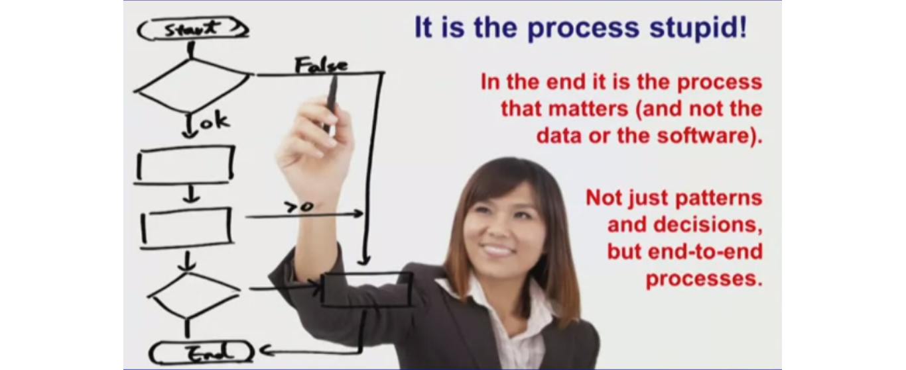
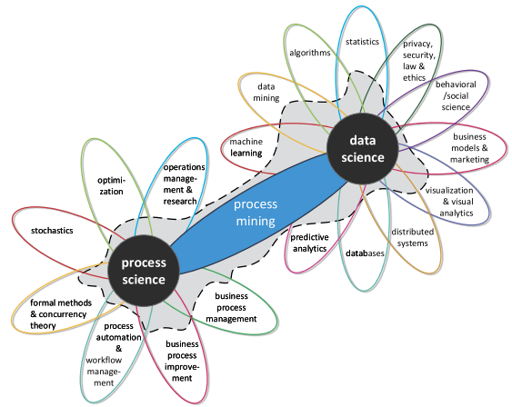
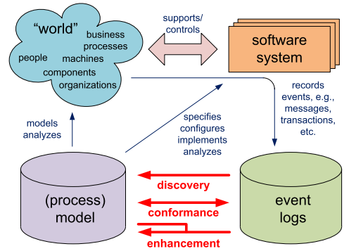
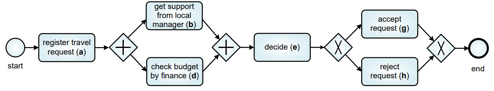

<<<<<<< HEAD
## Visão do processo global

Van der Aalst critica a abordagem que foca apenas em padrões ou decisões isoladas, pois acredita que o verdadeiro valor está em entender e otimizar o processo de ponta a ponta. Ele considera "estúpido" tratar processos como uma coleção desconexa de boas práticas ou intervenções pontuais, pois isso ignora a eficiência global e os impactos no resultado final. Um processo pode ter partes otimizadas, mas se o fluxo completo não funcionar bem, o desempenho geral será comprometido. O foco em processos de ponta a ponta é essencial para alinhar eficiência local e global, gerando melhores resultados.

=======
>>>>>>> f739a2d4ce602f1c032b96b048c70b5bdc197815
## Mineração de Processos

 A **Mineração de Processos (Process Mining)** analisa dados reais para revelar como os processos realmente acontecem, corrigindo desvios e eliminando gargalos. Essa abordagem enfatiza que decisões e melhorias devem ser baseadas na jornada completa do processo, garantindo que cada etapa contribua para o objetivo final. 

A **mineração de processos**, ou **process mining**, é um área que combina **modelos de processos de négocio** com a Ciência de Dados, ou seja, a partir de event logs ocorre a extração do modelo dos processos ou a análise de desempenho, gargalos, conformidade e etc.

> "Process mining adds the process perspective to machine learning and data mining.
Process mining seeks the confrontation between event data (i.e., observed behavior) and process models (hand-made or discovered automatically). Event data are
related to explicit process models, e.g., Petri nets or BPMN models. For example, process models are discovered from event data or event data are replayed on
models to analyze compliance and performance" (van der Aalst, 2016).

## Exemplo na Construção Civil

Imagine a construção de um prédio. Se nos concentrarmos apenas em tarefas isoladas, como a alvenaria ou a instalação elétrica, podemos otimizar cada uma delas individualmente, mas o projeto como um todo pode sofrer. Por exemplo, se a equipe de elétrica chegar muito cedo para iniciar seu trabalho, enquanto a equipe de alvenaria ainda não concluiu sua parte, haverá um tempo de inatividade e recursos ociosos.

**Visão fragmentada:**

* **Foco:** Cada equipe trabalha de forma isolada, otimizando apenas suas tarefas.
* **Problema:** A equipe de encanamento inicia seu trabalho antes que a estrutura esteja completamente pronta, causando atrasos e retrabalhos.

**Visão da mineração de processos:**

* **Foco:** O processo de construção como um todo, desde a concepção do projeto até a entrega da obra.
* **Solução:** Criação de um cronograma detalhado, com todas as etapas interligadas e prazos bem definidos. As equipes são informadas sobre as dependências entre as tarefas, evitando atrasos e otimizando o uso de recursos.

**Benefícios da visão de mineração de processos na construção civil:**

* **Redução de custos:** Minimização de retrabalhos, otimização do uso de materiais e redução de tempo de obra.
* **Melhora da qualidade:** Aumento da precisão e da qualidade do trabalho, com menos erros e defeitos.
* **Aumento da produtividade:** Melhor coordenação entre as equipes, redução de interrupções e otimização do fluxo de trabalho.
* **Maior satisfação do cliente:** Entrega do projeto dentro do prazo e com a qualidade esperada.

<!--

* **Mapeamento detalhado do processo:** Identificar todas as etapas do processo de construção, desde a concepção do projeto até a entrega da obra.
* **Análise das interdependências:** Identificar como cada etapa do processo se relaciona com as outras.
* **Otimização do fluxo de trabalho:** Eliminar atividades que não agregam valor, reduzir o tempo de espera entre as etapas e otimizar a utilização de recursos.
* **Monitoramento contínuo:** Acompanhar o desempenho do processo e realizar ajustes conforme necessário.

**Em resumo,** ao adotar uma visão de ponta a ponta, as empresas de construção podem otimizar seus processos, reduzir custos, melhorar a qualidade e aumentar a satisfação dos clientes. A ideia de van der Aalst de que "o processo é estúpido" serve como um lembrete de que a eficiência e a qualidade de um projeto dependem da otimização do processo como um todo, e não apenas de cada tarefa individual.-->

## **Como aplicar a ideia na prática:**

Para aplicar mineração de processos em um caso de uso específico, é essencial fazer perguntas que ajudem a entender o contexto, os objetivos e os dados disponíveis. Essas perguntas podem ser divididas em três categorias principais: entendimento do processo, definição de objetivos e dados e ferramentas. 

Para aplicar **mineração de processos** em um caso de uso específico, é essencial fazer perguntas que ajudem a entender o contexto, os objetivos e os dados disponíveis. Essas perguntas podem ser divididas em três categorias principais: **entendimento do processo**, **definição de objetivos** e **dados e ferramentas**. Aqui estão as principais perguntas:

---

### 1. **Entendimento do Processo**
Essas perguntas ajudam a mapear o contexto e o funcionamento do processo:
- **Qual é o processo que será analisado?**
  - Exemplo: É um processo de vendas, atendimento ao cliente, produção, etc.?
- **Quais são as entradas, atividades e saídas do processo?**
  - O que inicia o processo? Como ele termina?
- **Quais são as principais etapas ou atividades envolvidas?**
  - Liste as tarefas ou fluxos gerais (ex.: aprovação, conferência, execução).
- **Existem variações conhecidas no processo?**
  - O processo segue sempre o mesmo fluxo ou tem desvios frequentes?
- **Quais são os objetivos principais desse processo?**
  - É maximizar a eficiência? Garantir conformidade? Melhorar a experiência do cliente?

---

### 2. **Definição de Objetivos**
Perguntas para identificar o que a mineração de processos deve alcançar:
- **Qual problema específico estamos tentando resolver?**
  - Exemplo: Reduzir atrasos, eliminar gargalos, ou melhorar a qualidade?
- **Quais indicadores de desempenho (KPIs) devem ser analisados?**
  - Exemplos: Tempo de ciclo, custo, taxa de conclusão, erros.
- **Estamos buscando otimizar, monitorar ou auditar o processo?**
  - O foco é eficiência, detecção de desvios ou conformidade com regras?
- **Quais seriam os benefícios esperados com a análise?**
  - Exemplo: Identificar gargalos ou eliminar atividades que não agregam valor.
- **Quais decisões dependem das descobertas da mineração de processos?**
  - Exemplo: Redesenho do fluxo, implementação de automação ou treinamento.

---

### 3. **Dados e Ferramentas**
Perguntas para garantir que os dados necessários estão disponíveis e que as ferramentas corretas serão usadas:
- **De onde vêm os dados do processo?**
  - Exemplo: Logs de sistemas ERP, CRM, sistemas de ticket, etc.
- **Os dados contêm as informações mínimas necessárias?**
  - Devem incluir: **caso (ID único do processo), atividade (ações realizadas)** e **timestamp (tempo de execução)**.
- **Quais ferramentas de mineração de processos serão usadas?**
  - Exemplo: Celonis, Disco, ProM, etc.
- **Existem problemas conhecidos com os dados?**
  - Exemplo: Inconsistência, dados incompletos ou falta de integração entre sistemas.
- **Quem são os stakeholders que devem validar as descobertas?**
  - Exemplo: Gerentes de processo, analistas de negócio, TI.

---

### Exemplo de Aplicação
Suponha que você esteja analisando um processo de **aprovação de empréstimos em um banco**. As perguntas poderiam ser:

1. **Entendimento do Processo**
   - Como um cliente solicita o empréstimo?
   - Quais departamentos participam da aprovação?
   - Existe um prazo ideal para concluir a análise?

2. **Definição de Objetivos**
   - Estamos buscando reduzir o tempo médio de aprovação?
   - Queremos identificar gargalos específicos, como espera por documentos?

3. **Dados e Ferramentas**
   - Os sistemas bancários registram todas as interações?
   - As ferramentas disponíveis permitem conectar os logs das diferentes etapas?

---
### Definir event Logs

**Event log** ou **registros de evento** são tabelas que contém as informações de execução dos processos. Nesta tabela, cada linha representa um evento e contém ao menos três colunas essenciais, sendo elas

- case id - contém um identificador da instância do processo ao qual o evento pertence;
- activity - a atividade que foi realizada no evento;
- timestamp - a data e hora em que o evento ocorreu (inicio, fim ou outro marco temporal).

podem também ter outras colunas, como resources, que indicam o recurso ou pessoa responsável pela execução da atividade, além de  quaisquer outras informações relevantes. Vale dizer que nem sempre a tabela contém uma única coluna de timestamp. Em alguns casos, pode haver colunas separadas para o início e o fim de cada evento.

| _student name/caseId_ | _course name/activity_       | _exam date/timestamp_ | _mark/other data_ |
| --------------------- | ---------------------------- | --------------------- | ----------------- |
| Peter Jones           | Business Information Systems | 16-1-2014             | 8                 |
| Sandy Sott            | Business Information Systems | 16-1-2014             | 5                 |
| Bridget White         | Business Information Systems | 16-1-2014             | 9                 |
| Sandy Scott           | BPM Systems                  | 17-1-2014             | 8                 |
| Bridget White         | BPM Systems                  | 17-1-2014             | 7                 |
| Sandy Scott           | Process Mining               | 20-1-2014             | 9                 |
| John Anderson         | Process Mining               | 20-1-2014             | 6                 |

| _order number / caseId_ | _activity_     | _timestamp_     | _user / resource_ | _product / other data_ | _quantity / other data_ |
| ----------------------- | -------------- | --------------- | ----------------- | ---------------------- | ----------------------- |
| 9901                    | register order | 22-1-2014#09.15 | Sara Jones        | iPhone5s               | 1                       |
| 9902                    | register order | 22-1-2014#09.18 | Sara Jones        | iPhone5s               | 2                       |
| 9901                    | check stock    | 22-1-2014#09.49 | Pete Scott        | iPhone5s               | 1                       |
| 9901                    | ship order     | 22-1-2014#10.11 | Sue Fox           | iPhone5s               | 1                       |
| 9901                    | handle payment | 22-1-2014#10.41 | Carol Hope        | iPhone5s               | 1                       |

<<<<<<< HEAD
## Analisar os processos

### Tipos de process mining
=======
### **Tipos de mineração de processo**
>>>>>>> f739a2d4ce602f1c032b96b048c70b5bdc197815

Na mineração de processos, os tipos Play-in, Play-out e Replay referem-se a diferentes maneiras de interagir com e analisar os processos dentro de um sistema.

####  **Play Out**
A ideia é gerar um comportamento, event log, a partir de um modelo. Por exemplo, considere o modelo abaixo

Podemos a partir desse modelo gerar o seguinte event log:

| case | activity                           | timestamp      | resource |
| ---- | ---------------------------------- | -------------- | -------- |
| 235  | register travel request (a)        | 18-8-2014:9.15 | John     |
| 235  | get support from local manager (b) | 18-8-2014:9.25 | Mary     |
| 235  | check budget by finance (d)        | 19-8-2014:8.55 | John     |
| 235  | decide (e)                         | 19-8-2014:9.36 | Sue      |
| 235  | accept request (g)                 | 19-8-2014.9.48 | Mary     |

#### **Play In**
Neste tipo geramos um modelo de processo a partir de um event log. Existem diversos algoritmos que fazem isso. Por exemplo, considere a seguinte sequência de letras, onde cada letra representa um evento:
- abdeg
- adbeg
- adbeh
- abdeh
A partir delas podemos determinar o seguinte modelo:

### **Replay** 
Por fim, no tipo replay nos buscamos verificar a conformidade do modelo de processos gerado ou já existente com a realidade. Desta forma podemos descobrir gargalos, processos sendo realizados fora de ordem, e outros desvios de desempenho.

> "The third type of process mining is enhancement. Here, the idea is to extend or improve an existing process model using information about the actual process recorded in some event log. Whereas conformance checking measures the alignment between model and reality, this third type of process mining aims at changing or extending the a-priori model" (van der Aalst, 2016).

## Referências

- VAN DER AALST, Wil. **Process Mining**: Data science in action. Springer Berlin Heidelberg, 2016.
