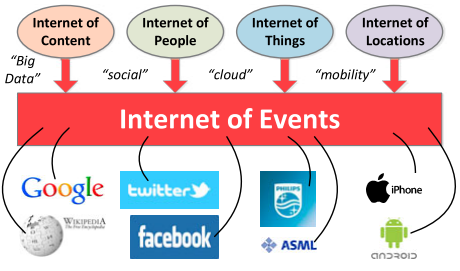
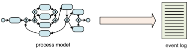

Nesta aula veremos um pouco sobre a mineração de processos, área essa que relaciona a modelagem de sistemas com a ciência de dados, permitindo transformar registros de eventos em melhorias para processos.  

## Dados é o novo petróleo!

Hoje em dia, nós estamos gerando uma quantidade de dados maior do que se juntarmos todas as informações da pré-história até o ano de 2003. 

Estamos criando constantemente **dados de evento (event data)**, quando

- marcamos uma consulta
- compramos uma xicara de café
- enviamos um e-mail
- assistimos um vídeo no YouTube
- através de todos os sensores em um smartphone

Quando falamos de todos esses dados sendo gravados, estamos falando da **Internet dos Eventos**.

### Big Data

Como falado antes, hoje nós conseguimos criar e gravar uma enorme quantidade de dados. Portanto, o desafio hoje é encontrar valor nesses dados.

####  Os 4 desafios do Big Data

- Volume: estamos criando grandes quantidades de dados
- Velocidade: a rapidez que os dados estão sendo criados e modificados
- Variedade: os dados não mudam apenas de tipo mas também de fontes como imagens, textos, vídeos, e devemos trabalhar com todos eles
- Veracidade: por conta do volume massivo de dados, pode existir uma dificuldade em verificar a confiabilidade dos dados

### Ramos da Ciência de Dados

## Mineração de Processos

A **mineração de processos**, ou **process mining**, é um área que combina **modelos de processos de négocio** com a Ciência de Dados, ou seja, a partir de event logs ocorre a extração do modelo dos processos ou a análise de desempenho, gargalos, conformidade e etc.

> "Process mining adds the process perspective to machine learning and data mining.
Process mining seeks the confrontation between event data (i.e., observed behavior) and process models (hand-made or discovered automatically). Event data are
related to explicit process models, e.g., Petri nets or BPMN models. For example, process models are discovered from event data or event data are replayed on
models to analyze compliance and performance" (van der Aalst, 2016).

### Event Logs

**Event log** ou **registros de evento** são tabelas que contém as informações de execução dos processos. Nesta tabela, cada linha representa um evento e contém ao menos três colunas essenciais, sendo elas

- case id - contém um identificador da instância do processo ao qual o evento pertence;
- activity - a atividade que foi realizada no evento;
- timestamp - a data e hora em que o evento ocorreu (inicio, fim ou outro marco temporal).

podem também ter outras colunas, como resources, que indicam o recurso ou pessoa responsável pela execução da atividade, além de  quaisquer outras informações relevantes. Vale dizer que nem sempre a tabela contém uma única coluna de timestamp. Em alguns casos, pode haver colunas separadas para o início e o fim de cada evento.

| _student name/caseId_ | _course name/activity_       | _exam date/timestamp_ | _mark/other data_ |
| --------------------- | ---------------------------- | --------------------- | ----------------- |
| Peter Jones           | Business Information Systems | 16-1-2014             | 8                 |
| Sandy Sott            | Business Information Systems | 16-1-2014             | 5                 |
| Bridget White         | Business Information Systems | 16-1-2014             | 9                 |
| Sandy Scott           | BPM Systems                  | 17-1-2014             | 8                 |
| Bridget White         | BPM Systems                  | 17-1-2014             | 7                 |
| Sandy Scott           | Process Mining               | 20-1-2014             | 9                 |
| John Anderson         | Process Mining               | 20-1-2014             | 6                 |

| _order number / caseId_ | _activity_     | _timestamp_     | _user / resource_ | _product / other data_ | _quantity / other data_ |
| ----------------------- | -------------- | --------------- | ----------------- | ---------------------- | ----------------------- |
| 9901                    | register order | 22-1-2014#09.15 | Sara Jones        | iPhone5s               | 1                       |
| 9902                    | register order | 22-1-2014#09.18 | Sara Jones        | iPhone5s               | 2                       |
| 9901                    | check stock    | 22-1-2014#09.49 | Pete Scott        | iPhone5s               | 1                       |
| 9901                    | ship order     | 22-1-2014#10.11 | Sue Fox           | iPhone5s               | 1                       |
| 9901                    | handle payment | 22-1-2014#10.41 | Carol Hope        | iPhone5s               | 1                       |

### **Tipos de mineração de processo**

Segundo van der Aalst (2016), a mineração de processos estabelece a relação entre modelos de processos e a realidade. Os termos Play-In, Play-Out e Replay expressam essa relação.

<blockquote>"One of the key elements of process mining is the emphasis on establishing a strong
relation between a process model and “reality” captured in the form of an event log.
Inspired by the terminology used by David Harel in the context of Live Sequence
Charts [70], we use the terms Play-In, Play-Out, and Replay to reflect on this relation" (van der Aalst, 2016).</blockquote>

#### **Play-In / Descoberta**

Neste tipo geramos um modelo de processo a partir de um event log. Existem diversos algoritmos que fazem isso. 

> "The first type of process mining is discovery. A discovery technique takes an
event log and produces a model without using any a-priori information. An example
is the α-algorithm [157] that will be described in Chap. 6. This algorithm takes
an event log and produces a Petri net explaining the behavior recorded in the log" (van der Aalst, 2016).

Por exemplo, considere a seguinte sequência de letras, onde cada letra representa um evento:

- abdeg
- adbeg
- adbeh
- abdeh

A partir delas podemos determinar o seguinte modelo:

####  **Play-Out / Conformidade**

A ideia é gerar um comportamento, event log, a partir de um modelo. 

> "The second type of process mining is conformance. Here, an existing process
model is compared with an event log of the same process. Conformance checking
can be used to check if reality, as recorded in the log, conforms to the model and vice
versa. For instance, there may be a process model indicating that purchase orders of
more than one million Euro require two checks. Analysis of the event log will show
whether this rule is followed or not" (van der Aalst, 2016).

Por exemplo, considere o modelo abaixo:

Podemos a partir desse modelo gerar o seguinte event log:

| case | activity                           | timestamp      | resource |
| ---- | ---------------------------------- | -------------- | -------- |
| 235  | register travel request (a)        | 18-8-2014:9.15 | John     |
| 235  | get support from local manager (b) | 18-8-2014:9.25 | Mary     |
| 235  | check budget by finance (d)        | 19-8-2014:8.55 | John     |
| 235  | decide (e)                         | 19-8-2014:9.36 | Sue      |
| 235  | accept request (g)                 | 19-8-2014.9.48 | Mary     |

#### **Replay / Aprimoramento** 

Por fim, no tipo replay nos buscamos verificar a conformidade do modelo de processos gerado ou já existente com a realidade. Desta forma podemos descobrir gargalos, processos sendo realizados fora de ordem, e outros desvios de desempenho.

> "The third type of process mining is enhancement. Here, the idea is to extend or improve an existing process model using information about the actual process recorded in some event log. Whereas conformance checking measures the alignment between model and reality, this third type of process mining aims at changing or extending the a-priori model" (van der Aalst, 2016).

## Referências

- VAN DER AALST, Wil. **Process Mining**: Data science in action. Springer Berlin Heidelberg, 2016.
