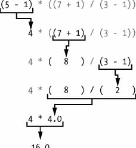
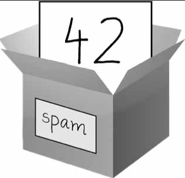

| [Próxima Aula](aula02.md) |

> - <a href="https://github.com/UniRobotica/cursos/blob/main/Informatica_Aplicada/Notebooks/Python%20Basico/Aula1_ConceitosBasicos.ipynb" target="_blank">Link do Notebook no Github</a>

> - <a href="https://colab.research.google.com/github/UniRobotica/cursos/blob/main/Informatica_Aplicada/Notebooks/Python%20Basico/Aula1_ConceitosBasicos.ipynb" target="_blank">Link do Notebook no Colab</a>

# O que é programar

Programar é simplesmente o ato de inserir instruções para o computador executar. Essas instruções podem processar alguns números, modificar texto, procurar informações em arquivos ou comunicar-se com outros computadores pela Internet.

Todos os programas usam instruções básicas como blocos de construção. Aqui estão alguns dos mais comuns, em inglês:

“Do this; then do that.”
“If this condition is true, perform this action; otherwise, do that action.”
“Do this action exactly 27 times.”
“Keep doing that until this condition is true.”


Você também pode combinar esses blocos de construção para implementar decisões mais complexas. Por exemplo, aqui estão as instruções de programação, chamadas de código-fonte , para um programa simples escrito na linguagem de programação Python. Começando no topo, o software Python executa cada linha de código (algumas linhas são executadas apenas se uma determinada condição for verdadeira ou então o Python executa alguma outra linha) até chegar ao final.

```python
passwordFile = open('SecretPasswordFile.txt') #atribui conteúdo do arquivo a variável passwordfile
secretPassword = passwordFile.read() #cria uma váriável secretPassword atribui o conteúdo de passwordfile
print('Enter your password.') #mostra na tela a frase Enter...
typedPassword = input() #cria outra vária typedPassword e requer entrada de conteúdo ao usuário
if typedPassword == secretPassword:  #estrutura condicional para conferência da senha
   print('Access granted')
   if typedPassword == '12345':
      print('That password is very easy.')
   elif typedPassword == 'cpd066':
      print('Computação Aplicada.')
else:
      print('Access denied')
```

Na verdade, ser bom em programação não é muito diferente de ser bom em resolver quebra-cabeças


> <a href="https://colab.research.google.com/" target="_blank">Colab</a>

> <a href="https://replit.com/" target="_blank">Replit</a>

> <a href="https://codewith.mu/en/about" target="_blank">codewith</a>

# Encontrando Ajuda

Por exemplo, vamos causar um erro propositalmente

```python
"42" + "3
```

Se você vir a mensagem de erro SyntaxError: EOL while scaning string literal , provavelmente esqueceu o caractere de aspas simples final no final da string, como neste exemplo

```python
'Ola Mundo'
```

```python
print('Ola Mundo)
```

# Instalando Módulos de Terceiros
Alguns códigos Python exigem que seu programa importe módulos. Alguns desses módulos vêm com Python, mas outros são módulos de terceiros criados por desenvolvedores fora da equipe principal de desenvolvimento do Python.

É importante ter uma “mentalidade construtiva” em relação à programação – em outras palavras, entender que as pessoas desenvolvem habilidades de programação através da prática. 

# Inserindo Expressões

| Operador | Operação        | Exemplo | Resultado |
| -------- | --------        | ------- | --------- |
| **       | Exponencial     | 2 ** 3  | 8         |
| %        | Modulo / Resto  | 22 % 8  | 6         |
| //       | Divisão inteira | 22 // 8 | 2         |
| /        | Divisão         | 22 / 8  | 2.75      |
| *        | Multiplicação   | 3 * 5   | 15        |
| -        | Subtração       | 5 - 2   | 3         |
| +        | Adição          | 2 + 2   | 4         |

```python
2 + 3 * 6
```

```python
2 ** 8
```

```python
23 / 7
```

```python
22 % 2
```

```python
23 % 2
```

```python
24 // 8
```

```python
import math
math.sqrt(4)
```

# Precedência
A ordem das operações (também chamada de precedência ) dos operadores matemáticos do Python é semelhante à da matemática. 

O operador ** é avaliado primeiro; os operadores * , / , // e % são avaliados a seguir, da esquerda para a direita; e os operadores + e - são avaliados por último (também da esquerda para a direita). 

Você pode usar parênteses para substituir a precedência usual, se necessário. O espaço em branco entre os operadores e os valores não importa para o Python (exceto o recuo no início da linha), mas um único espaço é uma convenção.

```python
5 - 1 * ((7 + 1) / (3 - 1))
```

```python
(5 - 1) * ((7 + 1) / (3 - 1))
```

Python continuará avaliando partes da expressão até que ela se torne um valor único, conforme mostrado aqui



# Tipos de dados inteiro, ponto flutuante e string

| Tipo de Dado                              | Exemplos                         |
| ---                                       | ---                              |
| Inteiros ``int``                          | -2, -1, 0, 1, 2                  |
| Números com ponto flutuante ``float``     | -1.25, -1.0, -0.5, 1.0           |
| Texto ``String``                          | 'a', 'aa', 'Hello', ' Olá, Mundo!|                   

# Concatenação e replicação de strings

```python
'Alice' + 'Bob'
```

```python
'Alice' + 42
```

```python
'Alice' * 5
```

```python
'Alice' * 5.0
```

# Armazenando Valores em Variáveis
Uma variável é como uma caixa na memória do computador onde você pode armazenar um único valor. Se quiser usar o resultado de uma expressão avaliada posteriormente em seu programa, você pode salvá-lo dentro de uma variável.



# Declarações de Atribuição
Você armazenará valores em variáveis ​​com uma instrução de atribuição . Uma instrução de atribuição consiste em um nome de variável, um sinal de igual (chamado operador de atribuição ) e o valor a ser armazenado. Se você inserir a instrução de atribuição spam = 42 , então uma variável chamada spam terá o valor inteiro 42 armazenado nela.

```python
num1 = 42
```

```python
num1
```

```python
num1 = 10
```

```python
num2 = 2
```

```python
num1 + num2
```

Uma variável é inicializada (ou criada) na primeira vez que um valor é armazenado nela. Depois disso, você poderá utilizá-lo em expressões com outras variáveis ​​e valores . Quando um novo valor é atribuído a uma variável , o valor antigo é esquecido. Isso é chamado de sobrescrever a variável.

```python
num1 + num2 + num1
```

```python
num1 = num1 + 2
num1
```

```python
msg = 'Hello'
msg
```


```python
msg = 'Goodbye'
msg
```

```python
msg = input()
msg
```

```python
msg = msg + " à engenharia"
msg
```

```python
msg = msg + 1
```

```python
msg = input()
```

```python
msg
```

```python
num1 = num1 + 1
```

```python
num1 = int(num1)
num1
```

```python
num1 = num1 + 1
num1
```
```python
int(.70975858858) + 1
```

```python
num2 = 20
num2 = num2 + 1
```

```python
num2
```

# Nomes de variáveis

Um bom nome de variável descreve os dados que ela contém. Imagine que você se mudou para uma nova casa e rotulou todas as suas caixas de mudança como "Coisas" . Você nunca encontraria nada! 
Em seus programas, um nome descritivo ajudará a tornar seu código mais legível.

Embora você possa nomear suas variáveis ​​de quase qualquer coisa, o Python tem algumas restrições de nomenclatura. 

Você pode nomear uma variável como quiser, desde que ela obedeça às três regras a seguir:

* Pode ser apenas uma palavra sem espaços.
* Ele pode usar apenas letras, números e o caractere de sublinhado ( _ ).
* Não pode começar com um número.

Os nomes das variáveis ​​diferenciam maiúsculas de minúsculas, o que significa que spam , SPAM , Spam e sPaM são quatro variáveis ​​diferentes. Embora Spam seja uma variável válida que você pode usar em um programa, é uma convenção do Python iniciar suas variáveis ​​com uma letra minúscula.

Usamos o estilo camelcase para nomes de variáveis ​​em vez de sublinhados; isto é, variáveis ​​lookLikeThis em vez de looks_like_this

| Nomes válidos de variáveis | Nomes inválidos de variável                 |
| -------------------------- | ---------------------------                 |
| current_balance            | current-balance (hifens não são permitidos) |
| currentBalance             | current balance (espaços não são permitidos)|
| account4                   | 4account (não pode começar com um número)   |
| _42                        | 42 (não pode começar com um número)         |
| TOTAL_SUM                  | TOTAL_\$UM (caracteres especiais como \$ não são permitidos)|
| hello                      | 'hello' (caracteres especiais como ' não são permitidos)|

```python
# This program says hello and asks for my name.
print('Hello, world!') # alô mundo
#print('What is your name?')    # ask for their name
myName = input('What is your name?') #requer uma entrada do usuário e associa esta a variável myName
print(myName) #mostra na tela o conteúdo da variável
print('Hello, world ' + myName + '!') # alô mundo
```

# A função print()
A função print() exibe o valor da string entre parênteses na tela.

```python
print('It is good to meet you, ' + myName)
```

Quando Python executa esta linha, você diz que Python está chamando a função print() e o valor da string está sendo passado para a função. Um valor passado para uma chamada de função é um argumento . Notar que as cotas (aspas) não são impressas na tela. Eles apenas marcam onde a string começa e termina; eles não fazem parte do valor da string.

```python
print(f'It is good to meet you, ', myName)
```

# A função len()
Você pode passar para a função len() um valor de string (ou uma variável contendo uma string), e a função será avaliada como o valor inteiro do número de caracteres nessa string.

```python
print('The length of your name is:')
print()
print(len(myName))
```

# A função input()
A função input() espera que o usuário digite algum texto no teclado e pressione ENTER

# As funções str(), int() e float()
Se você quiser concatenar um número inteiro com uma string para passar para print() , você precisará obter o valor '' , que é a forma de string. A função str() pode receber um valor inteiro e será avaliada como uma versão de valor de string do inteiro, como segue:

```python
print('What is your age?')    # ask for their age
myAge = input()
print('You will be ' + str(int(myAge) + 1) + ' in a year.')
```

```python
print('What is your age?')    # ask for their age
myAge = input()
print('You will be ' + str(int(myAge) + 1) + ' in a year.')
```


As funções str() , int() e float() serão avaliadas nas formas string, inteiro e ponto flutuante do valor que você passa, respectivamente.

```python
msg
```

```python
'msg'
```

```python
str(0)
```

```python
str(-3.14)
```

```python
int('42')
```

```python
int('-99')
```

```python
#int(1.25)
#int(1.99)
#float('3.14')
float(10)
```

A função str() é útil quando você tem um número inteiro ou flutuante que deseja concatenar com uma string. A função int() também é útil se você tiver um número como valor de string que deseja usar em alguma matemática. Por exemplo, a função input() sempre retorna uma string, mesmo que o usuário insira um número. 

```python
msg = input()
msg
```

```python
msg * 10/5
```

O valor armazenado no spam não é o número inteiro, mas a string '' . Se você quiser fazer contas usando o valor em msg, use a função int() para obter a forma inteira de msg e armazene-a como o novo valor em msg.

```python
msg = int(msg)
msg
```

```python
msg * 10/5
```

A função int() também é útil se você precisar arredondar um número de ponto flutuante para baixo.

```python
int(7.7)
```

# Equivalência ente números

```python
42 == '42'
```

```python
42 == 42.0
```

```python
42.0 == 0042.000
```

# Exemplo na Engenharia Civil
Um exemplo simples de aplicação na área de engenharia civil é o calculo da tensão normal em uma coluna. Para isso, nós iremos utilizar da seguinte formula: 

<math>
    <mn>T</mn>
    <mo>=</mo>
    <mfrac>
        <mrow>
            <msub>
                <mn>F</mn>
                <mn>N</mn>
            </msub>
        </mrow>
        <mrow>
            <mn>A</mn>
        </mrow>
    </mfrac>
</math> 

Onde:

* T = Tensão;
* F<sub>N</sub> = Força Normal;
* A = Área da seção transversal da coluna.


<a href="http://www.profwillian.com/materiais/prob/01.033.pdf" target="_blank">Exemplo</a> - Calcule a tensão sobre a seguinte coluna:


```python
F = 8000
A = 10*(75+75)*2+(70+70)*10
T = F/A

print("A tensão foi de "+str(T)+" N/mm²")
```

# Referências

<a href="https://automatetheboringstuff.com/" target="_blank">Automate The Boring Stuff</a>

| [Próxima Aula](aula02.md) |
