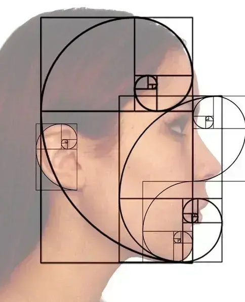
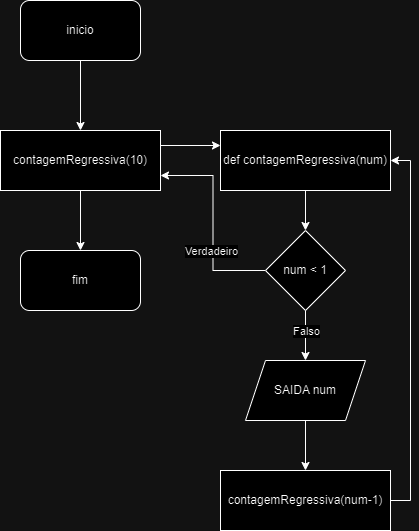

[Aula Anterior](aula03.md) | [Próxima Aula](aula05.md)

> - <a href="https://github.com/UniRobotica/cursos/blob/main/Informatica_Aplicada/Notebooks/Python%20Basico/Aula4_Fun%C3%A7%C3%B5es.ipynb" target="_blank">Link da aula no GitHub</a>

> - <a href="https://colab.research.google.com/github/UniRobotica/cursos/blob/main/Informatica_Aplicada/Notebooks/Python%20Basico/Aula4_Fun%C3%A7%C3%B5es.ipynb" target="_blank">Link da aula no Colab</a>

# Funções
Python fornece diversas funções integradas, mas você também pode escrever suas próprias funções. Uma função é como um miniprograma dentro de um programa.

```python
def hello(): #def nome_da_função(arg)
   print('Howdy!')
   print('Howdy!!!')
   print('Hello there.')
```

```python
hello() #chamando
```

```python
hello()
hello()
hello()
```

<a href="https://autbor.com/hellofunc/" target="_blank">https://autbor.com/hellofunc/</a>

No código, uma chamada de função é apenas o nome da função seguido de parênteses, possivelmente com algum número de argumentos entre os parênteses.

Quando a execução do programa atingir essas chamadas, ele irá para a linha superior da função e começará a executar o código ali. 

Ao chegar ao final da função, a execução retorna para a linha que chamou a função e continua percorrendo o código como antes.

Um dos principais objetivos das funções é agrupar o código que é executado várias vezes.

# Instruções def com parâmetros
Ao chamar a função print() ou len() , você passa valores para eles, chamados argumentos , digitando-os entre parênteses. Você também pode definir suas próprias funções que aceitam argumentos. 

```python
def hello(name):
    print('Hello, ' + name)
```

```python
hello()
```

```python
hello('Alice')
hello('Bob')
```

```python
name = "informatica"
```

```python
print(name)
```

A definição da função hello() neste programa possui um parâmetro chamado name. 
Parâmetros são variáveis ​​que contêm argumentos. Quando uma função é chamada com argumentos, os argumentos são armazenados nos parâmetros. 
Na primeira vez que a função hello() é chamada, é passado o argumento 'Alice'. 
A execução do programa entra na função e o nome do parâmetro é automaticamente definido como 'Alice' , que é impresso pela instrução print().

Uma coisa especial a ser observada sobre os parâmetros é que o valor armazenado em um parâmetro é esquecido quando a função retorna. Por exemplo, se você adicionou print(name) depois de hello('Bob') no programa anterior, o programa forneceria um NameError porque não há nenhuma variável chamada name. Esta variável é destruída após o retorno da chamada de função hello('Bob') , então print(name) se referiria a uma variável de nome que não existe. Isto é semelhante a como as variáveis ​​de um programa são esquecidas quando o programa termina.

```python
print(name)
```

# Definir, Chamar, Passar, Argumento, Parâmetro

Definir uma função é criá-la, assim como uma instrução de atribuição como spam = 42 cria a variável spam.

```python
def sayHello(name):
       print('Hello, ' + name)
```

```python
sayHello('Al')
```

A instrução def define a função sayHello(), que chama a função agora criada, enviando a execução para o topo do código da função. 
Esta chamada de função também é conhecida como passagem do valor da string 'Al' para a função. Um valor sendopassado para uma função em uma chamada de função é um argumento.
O argumento 'Al' é atribuído a uma variável local chamada name. 
Variáveis ​​que possuem argumentos atribuídos a elas são parâmetros.

# Valores de retorno e instruções de retorno
Quando você chama a função len() e passa um argumento como 'Hello' , a chamada da função é avaliada como o valor inteiro 5 , que é o comprimento da string que você passou. Em geral, o valor avaliado por uma chamada de função é chamado de valor de retorno da função.

Ao criar uma função usando a instrução def , você pode especificar qual deve ser o valor de retorno com uma instrução return . Uma instrução de retorno consiste no seguinte:

* A palavra-chave de retorno
* O valor ou expressão que a função deve retornar

Quando uma expressão é usada com uma instrução return , o valor de retorno é o valor avaliado pela expressão. 

Por exemplo, o programa a seguir define uma função que retorna uma string diferente dependendo do número que ela é passada como argumento. 

```python
len("informatica")
```

```python
import random

def getAnswer(answerNumber): #define função getAnswer (argumento=asnwerNumber)
    if answerNumber == 1:
           return 'It is certain' #return da função para aa condição deste if
    elif answerNumber == 2:
           return 'It is decidedly so'
    elif answerNumber == 3:
           return 'Yes'
    elif answerNumber == 4:
           return 'Reply hazy try again'
    elif answerNumber == 5:
           return 'Ask again later'
    elif answerNumber == 6:
           return 'Concentrate and ask again'
    elif answerNumber == 7:
           return 'My reply is no'
    elif answerNumber == 8:
           return 'Outlook not so good'
    elif answerNumber == 9:
           return 'Very doubtful'

r = random.randint(1, 9) #a função random.randint() é chamada com dois argumentos: 1 e 9. Ele é avaliado como um número inteiro aleatório entre 1 e 9 (incluindo os próprios 1 e 9 ), e esse valor é armazenado em uma variável chamada r .

fortune = getAnswer(r) #chama a função e passa como argumento

print(r)

print(fortune)
```

Como você pode passar valores de retorno como argumento para outra chamada de função, você pode encurtar estas últimas três linhas:

```python
print(getAnswer(random.randint(1, 9)))
```

# O valor None
Em Python, existe um valor chamado None , que representa a ausência de um valor. O valor None é o único valor do tipo de dados NoneType . (Outras linguagens de programação podem chamar esse valor de null , nil ou undefined .) Assim como os valores booleanos True e False , None deve ser digitado com N maiúsculo .

Esse valor sem valor pode ser útil quando você precisa armazenar algo que não será confundido com um valor real em uma variável. Um lugar onde None é usado é como valor de retorno de print() . A função print() exibe texto na tela, mas não precisa retornar nada da mesma forma que len() ou input() . Mas como todas as chamadas de função precisam ser avaliadas como um valor de retorno, print() retorna None. 

Python adiciona return None ao final de qualquer definição de função sem instrução de retorno . Isso é semelhante a como um loop while ou for termina implicitamente com uma instrução continue . Além disso, se você usar uma instrução return sem um valor (ou seja, apenas a palavra-chave return por si só), None será retornado

```python
vazio = print('Hello!')
```

```python
vazio
```

```python
None == vazio
```

Argumentos de palavras-chave são frequentemente usados ​​para parâmetros opcionais . Por exemplo, a função print() possui os parâmetros opcionais end e sep para especificar o que deve ser impresso no final de seus argumentos e entre seus argumentos

```python
print('Hello')
print('World')
```

```python
print('Hello', end=' ')
print('World')
```

```python
print('cats','dogs','mice')
```

```python
print('cats', 'dogs', 'mice', sep=',    ')
```

# CALL Stack

Imagine que você tem uma conversa sinuosa com alguém. 

Você fala sobre sua amiga Alice, o que então te lembra uma história sobre seu colega de trabalho Bob, mas primeiro você tem que explicar algo sobre sua prima Carol. 

Você termina sua história sobre Carol e volta a falar sobre Bob, e quando termina sua história sobre Bob, volta a falar sobre Alice. 

Mas então você se lembra de seu irmão David, então conta uma história sobre ele e depois volta a terminar sua história original sobre Alice. 

Sua conversa seguiu uma estrutura semelhante a uma pilha , como na Figura seguinte. 

A conversa é semelhante a uma pilha porque o tópico atual está sempre no topo da pilha.


Semelhante ao exemplo, chamar uma função não envia a execução em uma viagem só de ida ao topo de uma função. 

Python lembrará qual linha de código chamou a função para que a execução possa retornar para lá quando encontrar uma instrução de retorno . 

Se essa função original chamasse outras funções, a execução retornaria primeiro a essas chamadas de função, antes de retornar da chamada de função original.

```python
def a():
    print('a() inicia')
    b()
    d()
    print('a() retorna')

def b():
    print('b() inicia')
    c()
    print ('b() retorna')

def c():
    print('c() inicia')
    print('c() retorna')

def d():
       print('d() inicia')
       print('d() retorna')

a()
```


# Escopo Local e Global
Diz-se que os parâmetros e variáveis ​​atribuídos em uma função chamada existem no escopo local dessa função . Diz-se que variáveis ​​atribuídas fora de todas as funções existem no escopo global . Uma variável que existe em um escopo local é chamada de variável local , enquanto uma variável que existe no escopo global é chamada de variável global. Uma variável deve ser uma ou outra; não pode ser local e global.

* O código no escopo global, fora de todas as funções, não pode usar variáveis ​​locais.
* No entanto, o código em escopo local pode acessar variáveis ​​globais.
* O código no escopo local de uma função não pode usar variáveis ​​em nenhum outro escopo local.
* Você pode usar o mesmo nome para variáveis ​​diferentes se elas estiverem em escopos diferentes. Ou seja, pode haver uma variável local chamada spam e uma variável global também chamada spam .

```python
def funcao():
    num1 = 31337
    
funcao()
print(num1)
```

```python
def funcao():
    num1 = 31337
    print (num1)

funcao()
```

```python
num1
```

# Os escopos locais não podem usar variáveis ​​em outros escopos locais
Um novo escopo local é criado sempre que uma função é chamada, inclusive quando uma função é chamada de outra função. Considere este programa:  

```python
def funcao_principal():
    num1 = 99
    funcao_secundaria()
    print(num1)

def funcao_secundaria():
    num1 = 0
    num2 = 101
    
funcao_principal()
```

```python
def funcao():
    num1 = 99
    funcao_secundaria()
    print(num1)

def funcao_secundaria():
        num2 = 101
        num1 = 0
        print(num1)

funcao_secundaria()
```

# Variáveis ​​globais podem ser lidas em um escopo local

No seguinte programa: Como não existe nenhum parâmetro chamado num1 ou qualquer código que atribua um valor ao num1 na função funcao1() , quando num1 é usado em funcao1() , o Python considera isso uma referência à variável global num1 . É por isso que 42 é impresso quando o programa anterior é executado.

```python
def funcao1():
    print(num1)
    

num1 = 42

funcao1()

print(num1)
```

# Variáveis ​​locais e globais com o mesmo nome
Tecnicamente, é perfeitamente aceitável usar o mesmo nome de variável para uma variável global e variáveis ​​locais em escopos diferentes em Python. Mas, para simplificar a sua vida, evite fazer isso. 

```python
def funcao():
    escopo = 'funcao local'
    print(escopo)    # prints 'funcao local'

def funcao_secundaria():
    escopo = 'funcao_secundaria local'
    print(escopo)    # prints 'funcao_secundaria local'
    funcao()
    print(escopo)    # prints 'funcao_secundaria local'

escopo = 'global'
funcao_secundaria()

print(escopo)        # prints 'global'
```

```python
print(escopo)
```

# A declaração global
Se você precisar modificar uma variável global dentro de uma função, use a instrução global . Se você tiver uma linha como variáveis globais no topo de uma função, ela diz ao Python: “Nesta função, nome_da_variável se referem à variável global, então não crie uma variável local com este nome”. 

```python
def funcao():
  global escopo
  escopo = 'funcao'

escopo = 'global'
funcao()
print(escopo)
```

Existem quatro regras para saber se uma variável está em um escopo local ou global:

* Se uma variável estiver sendo usada no escopo global (ou seja, fora de todas as funções), então ela será sempre uma variável global.
* Se houver uma instrução global para essa variável em uma função, ela será uma variável global.
* Caso contrário, se a variável for usada em uma instrução de atribuição na função, ela será uma variável local.
* Mas se a variável não for usada em uma instrução de atribuição, ela será uma variável global.

```python
def funcao1():
  global escopo
  escopo = 'funcao1' # this is the global

def funcao2():
  escopo = 'funcao2' # this is a local
  print(escopo)

def funcao3():
  print(escopo) # this is the global

escopo = 42 # this is the global
funcao1()
print(escopo)
```

```python
funcao2()
funcao3()
```

Se você tentar usar uma variável local em uma função antes de atribuir um valor a ela, como no programa a seguir, o Python apresentará um erro. 

```python
def funcao():
    var_local = 'funcao local'
    print(var_local) # ERROR!
    
    

#escopo = 'global'
funcao()
#print(var_local)

print(var_local)
```

FUNÇÕES COMO “CAIXAS PRETAS”

Freqüentemente, tudo que você precisa saber sobre uma função são suas entradas (os parâmetros) e seu valor de saída; você nem sempre precisa se preocupar com o funcionamento real do código da função. 

Quando você pensa sobre funções dessa forma de alto nível, é comum dizer que você está tratando uma função como uma “caixa preta”.

# Manipulação de exceção

Por exemplo, considere o programa a seguir, que apresenta um erro de divisão por zero.

```python
def divisao(divideBy):
    return 42 / divideBy

print(divisao(2))
print(divisao(12))
print(divisao(0))
print(divisao(1))
```

Erros podem ser tratados com instruções try e except . O código que pode conter um erro é colocado em uma cláusula try . A execução do programa passa para o início de uma cláusula except seguinte se ocorrer um erro.

Você pode colocar o código anterior de divisão por zero em uma cláusula try e fazer com que uma cláusula except contenha código para lidar com o que acontece quando esse erro ocorre.

```python
def divisao(divideBy):
    try:
        return 42 / divideBy
    except ZeroDivisionError:
        print('Error: Invalid argument.')

print(divisao(2))
print(divisao(12))
print(divisao(0))
print(divisao(1))
```

<a href="https://autbor.com/tryexceptzerodivide/" target="_blank">https://autbor.com/tryexceptzerodivide/</a>

```python
def divisao(divideBy):
    return 42 / divideBy

try:
    print(divisao(2))
    print(divisao(12))
    print(divisao(0))
    print(divisao(1))
except ZeroDivisionError:
    print('Error: Invalid argument.')
```

Um programa curto: Ziguezague

Este programa criará um padrão em zigue-zague para frente e para trás até que o usuário o interrompa pressionando o botão Parar do editor ou pressionando CTRL-C 

```python
import time, sys
indent = 0 # How many spaces to indent.
indentIncreasing = True # Whether the indentation is increasing or not.

try:
    while True: # The main program loop.
        print(' ' * indent, end='')
        print('********')
        time.sleep(0.1) # Pause for 1/10 of a second.

        if indentIncreasing:
            # Increase the number of spaces:
            indent = indent + 1
            if indent == 20:
                # Change direction:
                indentIncreasing = False

        else:
            # Decrease the number of spaces:
            indent = indent - 1
            if indent == 0:
                # Change direction:
                indentIncreasing = True
except KeyboardInterrupt:
    sys.exit()
```

Escreva uma função chamada collatz() que tenha um parâmetro chamado number . 

Se o número for par, então collatz() deverá imprimir o número // 2 e retornar este valor. 

Se o número for ímpar, então collatz() deverá imprimir e retornar 3 * number + 1 .

Em seguida, escreva um programa que permita ao usuário digitar um número inteiro e continue chamando collatz() nesse número até que a função retorne o valor 1 .

(Surpreendentemente, esta sequência realmente funciona para qualquer número inteiro – mais cedo ou mais tarde, usando esta sequência, você chegará a 1! Mesmo os matemáticos não sabem ao certo por quê. Seu programa está explorando o que é chamado de sequência de Collatz, às vezes chamada de “o mais simples problema de matemática impossível.”)

Lembre-se de converter o valor de retorno de input() em um número inteiro com a função int() ; caso contrário, será um valor de string.

Dica: um número inteiro é par se o número % 2 == 0 e é ímpar se o número % 2 == 1 .

```python
def collatz(number):
  lst=[]
  lst.append(number)
  
  while(number!=1):
      if(number%2==0):
          number=number//2
          lst.append(number)
          
      else:
          number=number*3+1
          lst.append(number)
  
  i=0

  while i < len(lst):
    print(lst[i], sep="\n")
    i += 1 #i = i + 1

  
number = int(input("Digite um número"))

collatz(number)
```

# Série Fibonacci

# Definindo funções

A sequência de Fibonacci é um padrão numérico em que o primeiro e o segundo termo são iguais a 1 e cada termo a partir do terceiro é a soma dos dois termos anteriores.


# O que é Proporção Áurea?
Proporção áurea é uma constante real algébrica irracional utilizada na arquitetura, nas artes e no design gráfico. Ela é representada pela divisão de uma reta em dois segmentos (a e b), sendo que quando a soma desses segmentos é dividida pela parte mais longa, o resultado obtido é de aproximadamente 1,61803398875. Este valor é chamado de “número de Ouro”.




A distância entre o queixo e a base do nariz deve ser a mesma distância da base do nariz até a parte inferior da testa.

Essa mesma medida deve ser também o tamanho da testa e da orelha.

A proporção áurea no rosto também diz que o nariz tem a mesma largura do olho. Essa medida também é a distância entre um olho e outro.


Podemos criar uma função que escreve a série de Fibonacci até um limite arbitrário:

```python
def fib(n):    # write Fibonacci series up to n

    """Print a Fibonacci series up to n."""

    a, b = 0, 1

    while a < n:

        print(a, end=' ')

        a, b = b, a+b

    print()


# Now call the function we just defined:

#fib(2000)
#0 1 1 2 3 5 8 13 21 34 55 89 144 233 377 610 987 1597

'''A palavra reservada def inicia a definição de uma função. Ela deve ser seguida do nome da função e da lista de parâmetros formais entre parênteses. Os comandos que formam o corpo da função começam na linha seguinte e devem ser indentados.'''

#lembrar do docstring

'''Uma definição de função associa o nome da função com o objeto função na tabela de símbolos atual. O interpretador reconhece o objeto apontado pelo nome como uma função definida pelo usuário. Outros nomes também podem apontar para o mesmo objeto função e também pode ser usados pra acessar a função:
>>>

fib
<function fib at 10042ed0>

f = fib

f(100)
0 1 1 2 3 5 8 13 21 34 55 89'''

'''É fácil escrever uma função que retorna uma lista de números da série de Fibonacci, ao invés de exibi-los:
>>>

def fib2(n):  # return Fibonacci series up to n

    """Return a list containing the Fibonacci series up to n."""

    result = []

    a, b = 0, 1

    while a < n:

        result.append(a)    # see below

        a, b = b, a+b

    return result


f100 = fib2(100)    # call it

f100                # write the result
[0, 1, 1, 2, 3, 5, 8, 13, 21, 34, 55, 89]

Este exemplo demonstra novos recursos de Python:

    A instrução return finaliza a execução e retorna um valor da função. return sem qualquer expressão como argumento retorna None. Atingir o final da função também retorna None.

    A instrução result.append(a) chama um método do objeto lista result. Um método é uma função que ‘pertence’ a um objeto, e é chamada obj.nomemetodo, onde obj é um objeto qualquer (pode ser uma expressão), e nomemetodo é o nome de um método que foi definido pelo tipo do objeto. Tipos diferentes definem métodos diferentes. Métodos de diferentes tipos podem ter o mesmo nome sem ambiguidade. (É possível definir seus próprios tipos de objetos e métodos, utilizando classes, veja em Classes) O método append(), mostrado no exemplo é definido para objetos do tipo lista; adiciona um novo elemento ao final da lista. Neste exemplo, ele equivale a result = result + [a], só que mais eficiente.
'''
```

```python
fib(100)
```

```python
def fulano():
    print('fulano() inicia')
    sincrano()
    sincrana()
    print('fulano() retorna')

def sincrano():
    print('sincrano() inicia')
    fulana()
    print ('sincrano() retorna')

def fulana():
    print('fulana() inicia')
    print('fulana() retorna')

def sincrana():
       print('sincrana() inicia')
       print('sincrana() retorna')

fulano()
```

```python
def soma_matricula(matricula):  # Define a função que recebe a matrícula como argumento
    soma_pares = 0  # Inicializa a soma dos números pares
    soma_impares = 0  # Inicializa a soma dos números ímpares
    
    for numero in str(matricula):  # Itera sobre cada número da matrícula, convertendo-a para string
        numero_int = int(numero)  # Converte o número de string para inteiro
        if numero_int % 2 == 0:  # Verifica se o número é par
            soma_pares += numero_int  # Adiciona o número à soma dos pares
        else:  # Caso o número seja ímpar
            soma_impares += numero_int  # Adiciona o número à soma dos ímpares
    
    return soma_pares, soma_impares  # Retorna as somas dos números pares e ímpares

# Minha matrícula de exemplo
matricula = 123456  # Substitua pelo seu número de matrícula

# Chama a função e armazena os resultados
soma_pares, soma_impares = soma_matricula(matricula)

# Imprime os resultados em uma única linha
print(f"Soma dos números pares: {soma_pares}, Soma dos números ímpares: {soma_impares}")
```

# Funções recursivas

Uma função recursiva é toda aquela que chama a si mesma.



```python
def contagemRegressiva(num):
    if num < 1:
        return
    else:
        print(num)
        contagemRegressiva(num - 1)

contagemRegressiva(10)
```

Desta forma, uma função recursiva funciona como um loop e se não houver uma estruturação correta criará um loop infinito.

```python
def contagemRegressiva(num):
    print(num)
    contagemRegressiva(num - 1)

contagemRegressiva(10)
```

A estrutura de uma função recursiva é dividida em **caso base** e **caso recursivo**. O caso recursivo é aquele em que a função chama a si mesma, enquanto o caso base é aquele que encerra a recursão. Vejamos o exemplo a seguir.

```python
def fatorial(num):
    if num == 1: # Caso base
        return 1
    else: # Caso recursivo
        return num * fatorial(num-1)

n1 = int(input("Digite um número inteiro maior que 0: "))
a = fatorial(n1)

print(a)
```

# Exemplo na engenharia civil

Vamos criar uma função que recebe altura, largura e comprimento, e calcula o valor gasto para construir uma determinada volume de concreto. Para isso, considere a seguinte relação: para cada 1kg de cimento que for utilizado, serão necessarios 2kg de areia e 3kg de brita. Também considere a seguinte tabela de valores (por kg):
- Cimento -> R$ 4,50
- Areia   -> R$ 0,20
- Brita   -> R$ 0,55

```python
def calcularCustoConcreto(altura, largura, comprimento):
    volumeConcreto = altura * largura * comprimento # em m³
    # Como a densidade é a massa sobre o volume (d = m / v), então
    # podemos considerar que a massa é o volume vezes a densidade (m = v * d)
    # a densidade do concreto é de 2400 kg/m³
    massaConcreto = volumeConcreto * 2400 # em kg

    cimento = massaConcreto/6 # segundo a relação que definimos, o cimento é uma parte de 6 do concreto
    areia = cimento * 2 # para cada parte de cimento temos 2 de areia
    brita = cimento * 3 # para cada parte de cimento temos 3 de brita

    valorGastoCimento = cimento * 4.50
    valorGastoAreia = areia * 0.2
    valorGastoBrita = brita * 0.55
    valorTotal = valorGastoCimento + valorGastoAreia + valorGastoBrita

    return valorTotal

altura = 2.1
largura = 0.15
comprimento = 5
custo = calcularCustoConcreto(altura, largura, comprimento)

print(f"O custo total foi de R${custo:.2f}")
```


[Aula Anterior](aula03.md) | [Próxima Aula](aula05.md)
